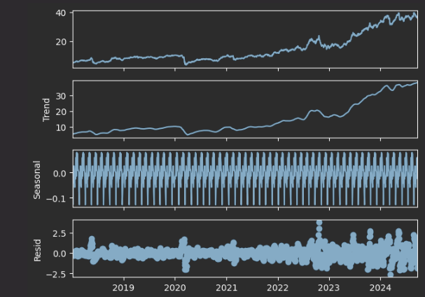
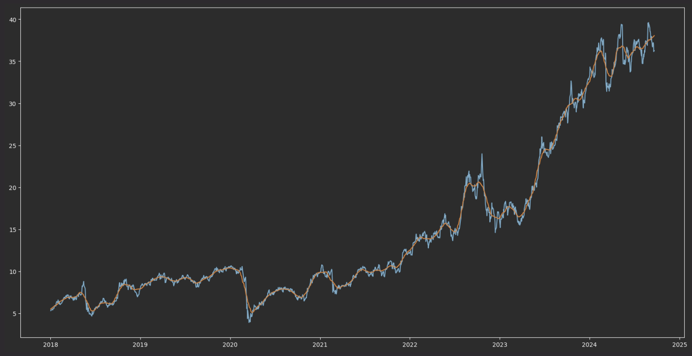
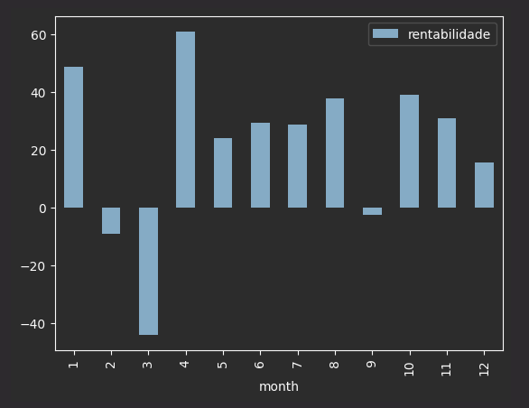
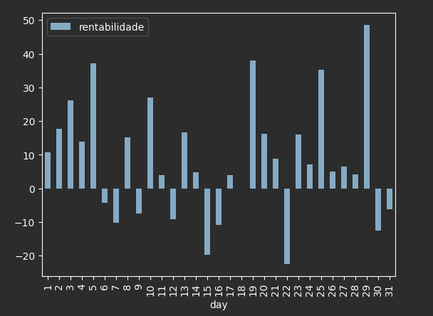
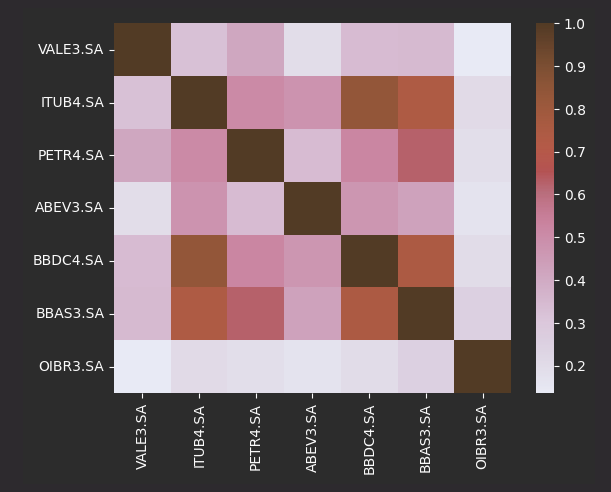

# series-temporais
Análise de Séries Temporais - Python - Pandas - StatsModel - MatplotLib

# Análise das ações PETR4 de 2018 a 2024

# Decomposição 

# Comportamento Valor Real e Tendência

# Rentabilidade por mês

# Rentabilidade por dia

# Correlação entre ações ao longo do tempo
